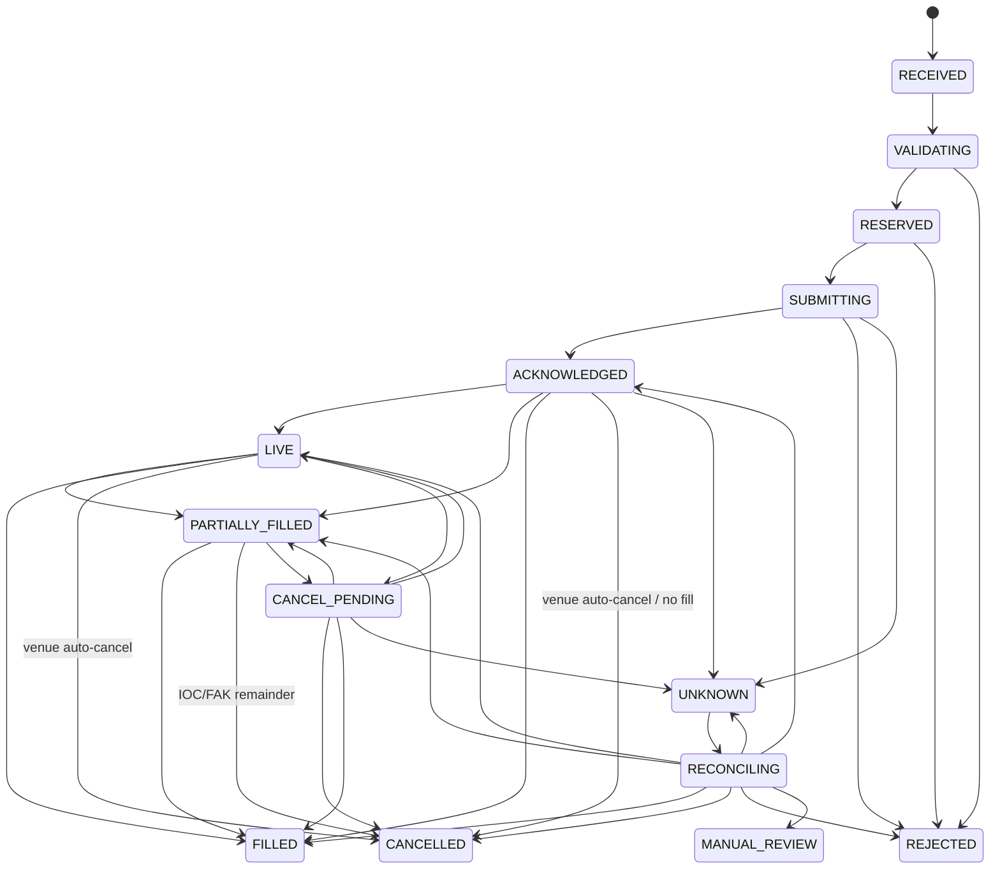

# 订单状态机与审计

状态机实现于 `internal/service/orderstate`，执行编排在 `internal/service/execution`，定时查询和订单到期处理在 `internal/service/ordercoordinator`。



`RECONCILING → PARTIALLY_FILLED/CANCELLED` 是实际撤单超时必须有的补充分支。否则“撤掉剩余部分、此前已部分成交”无法正确表达。

## accepted 和 filled

`ACKNOWLEDGED` 只表示 CLOB 接受了提交请求并返回 order ID，不表示成交。即使 POST 同步返回
`matched`，本地也先写 `SUBMITTING → ACKNOWLEDGED`；只有真实 `/data/trades` 记录达到
`CONFIRMED` 后，Fill ledger 才继续写 `PARTIALLY_FILLED/FILLED`。订单的 `size_matched` 只用于
发现需要加速拉取 trades，不直接生成成交。

## UNKNOWN 规则

POST/DELETE 发生 timeout、断连、5xx、响应截断或无法解析时，结果可能已经在交易所生效，必须走 `SUBMITTING/CANCEL_PENDING → UNKNOWN → RECONCILING`。同一个 `client_order_id` 重放只返回原订单，不会第二次调用 CLOB。连续 reconciliation 达到配置上限仍无法证明结果时，进入 `MANUAL_REVIEW`，资金和 shares 保持预占。

## Cancel Race

撤单前先持久化 `CANCEL_PENDING + STARTED attempt`：

- 撤单赢：进入 `CANCELLED`；live 模式在 Fill finality/grace 对账完成后才释放未成交预占；
- 成交赢：进入 `PARTIALLY_FILLED/FILLED`；
- 无法确认：进入 `UNKNOWN`，不释放资金、不盲目重撤。

## PostgreSQL 原子审计

迁移 `0002_order_lifecycle.sql` 创建 `execution_orders`、append-only `execution_order_events` 和
`execution_order_attempts`；迁移 `0003_fills_positions_ledger.sql` 增加 Fill 累计金额、手续费和
`fill_key` 审计关联。

```text
开始调用：状态迁移 + event + STARTED attempt       同一事务
结束调用：最终状态 + event + completed attempt     同一事务
```

如果进程在网络调用中崩溃，数据库只留下 `STARTED`，恢复流程将其视为不确定结果并查询 CLOB。revision compare-and-swap 防止两个 worker 同时推进同一订单。日志不会保存私钥、API secret、passphrase、签名或完整签名 body。

审计接口：

```text
GET /api/v1/orders/{order_id}/events
GET /api/v1/orders/{order_id}/attempts
```

## 超时协调器

`ordercoordinator.Sweep` 分批扫描陈旧订单：

- `RECEIVED/VALIDATING/RESERVED`：恢复崩溃前的校验或预占流程；`RESERVED` 会先重新做 Market 校验再提交；
- `SUBMITTING/UNKNOWN/CANCEL_PENDING/RECONCILING`：发起 reconciliation；
- `ACKNOWLEDGED/LIVE/PARTIALLY_FILLED`：刷新 CLOB；
- 达到 `expires_at` 的 acknowledged/live/partial 订单：先进入 `CANCEL_PENDING` 再撤单。

多个 coordinator 同时运行时，由 PostgreSQL revision 决定唯一胜者；失败 worker 不会再次调用交易所。
